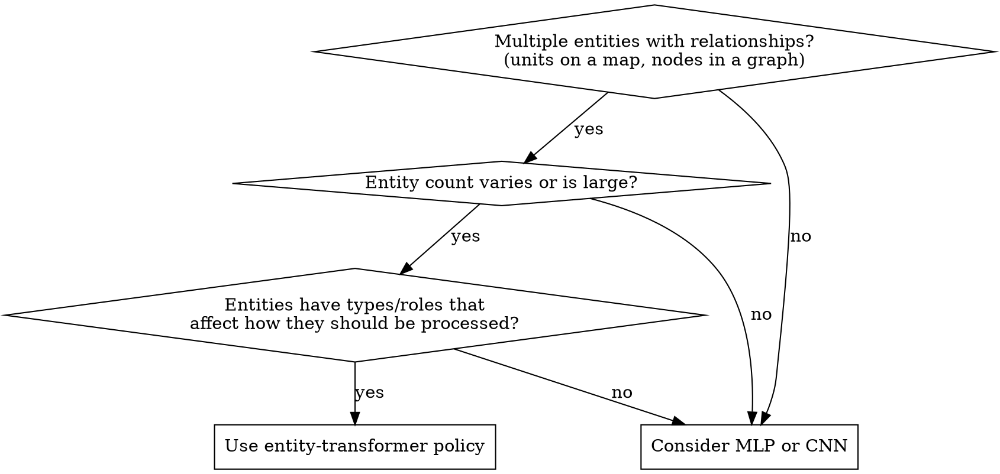

# Entity-Transformer Policies

## Overview

Represent each entity (planet, unit, node, agent) as a token in a transformer encoder. Entities attend to each other, producing contextualized hidden states. Action heads then read from specific tokens — a CLS token for global decisions, entity tokens for per-entity decisions.

**Core principle:** The transformer replaces both the graph neural network (entity relationships) and the global state aggregator (pooling). Entity-type and ownership embeddings give the model strong inductive biases about entity roles.

## When to Use



**Use when:**
- The environment has 10-1000+ entities with pairwise relationships
- Entity count varies between episodes or within an episode
- Entities have categorical types that affect how they should be processed
- You need global decisions (value, termination) AND per-entity decisions (which unit to act with)
- Entities have spatial positions that matter for their interactions
- You're already using transformers elsewhere in your stack

**Don't use when:**
- Entity count is fixed and small (< 10) — an MLP with concatenated state works fine
- Entities have no interactions — independent entity nets suffice
- The state is grid-based and translation-invariant — CNNs are more efficient
- Latency requirements preclude attention (consider linear attention or graph nets)

## Architecture Pattern

### Token Layout

```
Sequence: [CLS] [Entity₁] [Entity₂] ... [Entity_N] [padding...]
           ↑     ↑          ↑              ↑
      Global read  Per-entity action heads read from these positions
```

Fix the maximum entity count (e.g., 60). Pad with masked slots. The CLS token at position 0 aggregates global information for value estimation and global action decisions.

### Embedding Layer

```python
def embed(entity_type, owner, features, positions):
    x = (type_emb[entity_type]           # Embedding(num_types, d_model)
         + owner_emb[owner]              # Embedding(num_owners, d_model) 
         + feat_proj(features))          # Linear(feature_dim, d_model)
    return x
```

Three additive components:
1. **Type embedding** — What kind of entity is this? (CLS, planet, unit, building, etc.)
2. **Owner embedding** — Who controls it, from the current agent's perspective? (self, ally, enemy₁, enemy₂, neutral)
3. **Feature projection** — Raw scalar features (position, velocity, resources, status) projected to d_model

The type and owner embeddings give the transformer strong priors: entities of the same type are processed similarly, entities with the same owner share behavioral patterns.

### Spatial Encoding

For environments with 2D/3D positions, encode spatial coordinates into attention via Rotary Position Embedding (RoPE):

```python
def apply_rope_nd(q, k, positions, rope_dims=2):
    """Split head dims across position coordinates, apply 1D RoPE per chunk."""
    # With rope_dims=2 and 2D board: first half of head dims encode x, second half encode y
    chunk = head_dim // rope_dims
    for i in range(rope_dims):
        q_chunk[i] = apply_rope_1d(q_chunk[i], positions[..., i])
        k_chunk[i] = apply_rope_1d(k_chunk[i], positions[..., i])
```

This makes attention scores depend on relative spatial positions, which is exactly what you want for entity interactions. Nearby entities attend more strongly; the pattern "planet A is near planet B" is baked into the attention geometry.

**Normalization:** Position coordinates should be scaled to roughly [0, 1] range. The RoPE base frequency (default 10000) determines how finely position is resolved.

### Token Packing for Efficiency

Padding tokens waste FLOPs in attention. Stable-sort active tokens to the front:

```python
# Dense: [B, L_max, d] — many inactive padding tokens
# Packed: [B, L_active_max, d] — only active + small padding

counts = entity_mask.sum(dim=-1)           # active tokens per sample
L_packed = counts.max()                     # max active across batch
sort_keys = (~entity_mask).int()            # active=0, padding=1
pack_idx = sort_keys.argsort(stable=True)[:, :L_packed]
x_packed = x.gather(1, pack_idx)            # active tokens at front

# After encoder, scatter back to dense for fixed-position head reads
x_dense = scatter(x_packed, pack_idx)       # padding rows contain garbage — heads don't read them
```

**FLOP reduction:** Attention is O(L²). Packing from 61→15 active tokens reduces attention FLOPs by (61/15)² ≈ 16× in theory, 4-6× in practice (some padding remains). All ops remain plain dense PyTorch — compatible with `torch.compile`.

### Action Heads as Token Readers

Different action heads read from different token positions:

```python
h = transformer(x, rope_pos, padding_mask)  # [B, L, d_model]

# Global decisions: read from CLS token (position 0)
halt_logits = linear(h[:, 0, :])            # Binary: stop or continue?
value = linear(h[:, 0, :])                  # State value estimate

# Per-entity decisions: read from entity token positions
planet_h = h[:, 1:1+MAX_ENTITIES, :]        # [B, N, d]
origin_logits = linear(planet_h)            # Score each entity as action source
target_logits = target_mlp(planet_h, context)  # Score each entity as action target
```

**Key insight:** Action heads that pick "which entity" don't need to know about all entity pairs — they score each entity independently. Entity interactions are already encoded in the hidden states by the transformer's attention. So a simple per-entity linear layer suffices.

For heads that need pairwise entity information (e.g., "how good is entity A → entity B?"), concatenate the two entity hidden states and add context features:

```python
# Target pick head: score each possible destination for a chosen origin
target_input = cat([
    target_hidden,       # d_model: transformer output for this target entity
    fleet_size / 1000,   # scalar: how many ships are being sent
    eta / 500,           # scalar: travel time
    is_bigger,           # bool: will the fleet overpower the target garrison?
])
target_score = target_mlp(target_input)  # MLP: d+3 → d → d/2 → 1
```

## Population / Multi-Task Architecture

When training a diverse set of policies (e.g., for league play or multi-task RL), share the early transformer layers and branch only at the end:

```
Shared: TransformerBlock × (n_layers - 1)    ← shared features
  ├─ Tail₀: TransformerBlock + all heads     ← private for population member 0
  ├─ Tail₁: TransformerBlock + all heads     ← private for population member 1
  └─ Tail₂: TransformerBlock + all heads     ← private for population member 2
```

Each population member gets its own final transformer block and all action heads. The shared layers learn general entity representations; the private tails learn member-specific strategies.

**Batch organization:** Interleave or group population members in the batch. Grouping by member allows contiguous forward passes without index_select overhead.

## Implementation Checklist

- [ ] Define entity types (CLS, unit types, building types, etc.) and owner slots (self, ally, enemy, neutral)
- [ ] Fix maximum entity count — pad with inactive slots
- [ ] Build embedding: type_emb + owner_emb + feature_projection
- [ ] Add spatial encoding if positions matter (RoPE for 2D/3D, or learned position embeddings)
- [ ] Implement token packing if entity count varies significantly
- [ ] CLS token at position 0 for value and global action heads
- [ ] Per-entity linear heads for "which entity" decisions
- [ ] Pairwise MLP heads for "entity A → entity B" decisions (concat hidden states + context)
- [ ] Consider population architecture if training multiple policies
- [ ] Verify `torch.compile` compatibility — avoid NestedTensor, dynamic control flow

## Concrete Example: Orbit Wars

- **Entities:** 1 CLS token + up to 60 planet slots (40 base + 20 comets)
- **Entity types:** CLS=0, Planet=1, Comet=2
- **Owner embeddings:** neutral=0, self=1, opponent₁=2, opponent₂=3, opponent₃=4
- **Spatial encoding:** 2D RoPE on (x/100, y/100) board coordinates
- **Default model:** d_model=192, n_heads=8, n_layers=4, packing from 61→~15 tokens
- **Action heads:** Halt/Launch ← CLS, Origin-Fraction ← per-planet linear, Target ← per-planet MLP (planet hidden + fleet context)
- **Population:** Shared 3 layers + 1 private layer per member for league training against past checkpoints

## Common Mistakes

| Mistake | Fix |
|---------|-----|
| Putting fleet/transient entities as sequence tokens | Encode transients as per-entity features (countdown bins). Tokens are for persistent entities. |
| No entity type embeddings | Without type embeddings, CLS looks like a planet. Add Embedding(num_types, d_model). |
| Using learned position embeddings for spatial domains | Use RoPE — it gives relative position in attention, not absolute. |
| Running attention on full padded sequence | Token-pack active entities to front — 4-6× speedup. |
| Action heads that concatenate all entity states | Let attention do the mixing. Heads read individual entity hidden states. |
| No owner embeddings in multi-agent settings | Without owner info, the model can't distinguish friend from foe. |
| Forgetting to normalize spatial coordinates for RoPE | Scale to [0,1] or [-1,1] range. RoPE frequencies assume O(1) inputs. |
