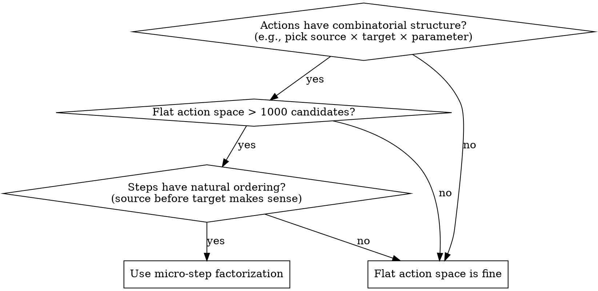

# Micro-Step Action Factorization

## Overview

Decompose a complex action space into a sequence of smaller micro-decisions, each treated as an RL timestep. Instead of sampling from a flat joint distribution over all combinations, the agent makes sequential choices — each choice produces its own reward signal and value estimate.

**Core principle:** The environment pauses its macro clock until a terminal micro-action (e.g., "halt") is selected. Intermediate micro-steps share the same macro state but differ in action masks as prior choices constrain later ones.

## When to Use



**Use when:**
- The action space is combinatorial (e.g., pick origin × fraction × target from 44 planets × 5 fractions each ≈ 9,460 candidates)
- Actions have a natural sequential dependency (target selection depends on origin choice)
- You want the policy to be able to "change its mind" mid-decision
- Credit assignment to individual sub-decisions matters
- You need action masks that depend on prior sub-decisions

**Don't use when:**
- The action space is small enough to enumerate (< 100 candidates)
- Sub-decisions are truly independent (joint prediction is more efficient)
- The environment cannot pause its macro clock between sub-decisions
- All sub-decisions must be made simultaneously for correctness

## Core Pattern

### Before: Flat Action Space

```python
# One massive distribution: 44 origins × 5 fractions × 43 targets ≈ 9,460 logits
# Most are invalid (can't reach target from origin due to geometry)
# Masking 9,460 entries per step is expensive and wasteful
action_logits = policy.flat_action_head(state)  # [B, 9460]
action = sample_from_masked_logits(action_logits, validity_mask)
```

### After: Factorized Micro-Steps

```python
# Micro-step 1: Halt or launch?
halt_logits = policy.halt_head(state)  # [B, 2]
if sample(halt_logits) == HALT:
    return  # macro turn ends, no fleet launched

# Micro-step 2: Pick origin + send fraction (joint)
origin_logits = policy.origin_head(state)      # [B, num_planets]
frac_logits = policy.frac_head(state)          # [B, num_planets, 5]
origin, frac = sample_joint(origin_logits, frac_logits, mask=owned_planets_with_ships)

# Micro-step 3: Pick target (only reachable planets from chosen origin)
reachable = compute_reachable_targets(origin)  # hard geometry, not learned
target_logits = policy.target_head(state, origin, frac)  # [B, reachable_count]
target = sample(target_logits, mask=reachable)

# Fleet launched. Environment macro-clock advances only now.
```

Each micro-step is a full RL timestep — it gets its own GAE advantage, value target, and policy gradient.

## Key Design Decisions

### 1. Each micro-step is an RL step

The value function must estimate expected return from mid-macro-turn states. This means:
- **Halt** gets credit for knowing when to stop launching this turn
- **Origin+frac** gets credit for choosing good launch origins
- **Target** gets credit for picking good destinations

The value head sees the same observation but must understand that more launches may follow in the same macro turn.

### 2. Prune with hard constraints between micro-steps

Use non-learned rules to eliminate invalid candidates:
```
After origin+frac: only planets within flight range are valid targets (geometry)
After target: remove launched ships from origin's available count for next micro-step
```
This converts O(origins × fractions × targets) to O(origins + targets per origin).

### 3. Initialize action heads with strong safe priors

Early in training, bias toward safe defaults:

```python
# Halt head: 90% halt probability → biases policy toward caution
halt_head.bias = [0, log(0.9 / 0.1)]

# Fraction head: 10× weight on full-send → cleanest credit assignment
frac_head.bias = log_softmax([1, 1, 1, 1, 10])
```

Without these biases, the untrained policy samples random launches, creating chaotic trajectories that produce noisy gradients.

### 4. KL penalty toward prior instead of entropy bonus

For heads with strong initialization biases, replace entropy bonus with KL divergence:

```python
# Instead of: loss -= entropy_coef * entropy(action_distribution)
# Use:       loss += kl_coef * KL(prior_distribution || action_distribution)
```

**Why:** Entropy bonus encourages uniform exploration — it fights the initialization bias. KL toward prior allows the policy to deviate when beneficial, but charges a cost proportional to how far it strays from sensible behavior. This keeps early exploration near the safe default while still permitting specialization.

**Use KL priors when:**
- There is a clear safe default action (e.g., "do nothing")
- Random exploration creates unrecoverable states
- The action space has a natural "no-op"
- Early random actions poison credit assignment with noise

## Implementation Checklist

- [ ] Identify the natural sequential decomposition of your action space
- [ ] Define the macro-step boundary (which micro-action terminates the sequence?)
- [ ] Design action masks that prune candidates based on prior micro-decisions
- [ ] Set initialization biases toward safe defaults
- [ ] Treat each micro-step as an RL timestep (separate value, advantage, gradient update)
- [ ] Replace entropy bonus with KL toward prior for biased heads
- [ ] Ensure value function conditions on micro-step progress
- [ ] Add a maximum micro-steps cap to prevent infinite loops

## Concrete Example: Orbit Wars

A space strategy game where each turn you may launch multiple fleets from owned planets to capture neutral/enemy planets.

**Before factorization:** Flat action space = choose (origin, fraction, target, angle) from ~9,460 candidates per turn. Most are geometrically invalid.

**After factorization:**
1. **Halt/Launch**: Binary — stop launching this turn, or send another fleet
2. **Origin + Fraction**: Which owned planet to send from, what percentage (20%-100%) of its ships
3. **Target**: Which reachable planet to send to (pruned by discrete raycasting from origin)

This reduces candidate evaluation from ~9,460 to at most 44×5 + 43 ≈ 263 per micro-step.

The halt head is initialized to 90% halt probability. The fraction head is initialized with 10:1 bias toward full-send. Both use KL prior penalty instead of entropy bonus. Result: policy learns to launch only when beneficial, with clean credit assignment per launch decision.

## Common Mistakes

| Mistake | Fix |
|---------|-----|
| Sharing a single value across all micro-steps in a macro-turn | Each micro-step needs its own value estimate from that decision point |
| No termination cap → infinite micro-loops | Cap max micro-steps per turn, or strongly bias halt |
| Forgetting to recompute action masks between micro-steps | Recompute origin validity after each launch (ships depleted) |
| Using entropy bonus on biased initialization heads | Use KL toward prior — entropy fights the initialization bias |
| No hard pruning between steps (all learned) | Use geometry/rules to prune — faster and eliminates invalid candidates entirely |
| Not encoding micro-step position in state | Add turn-progress feature or remaining-launches counter |
